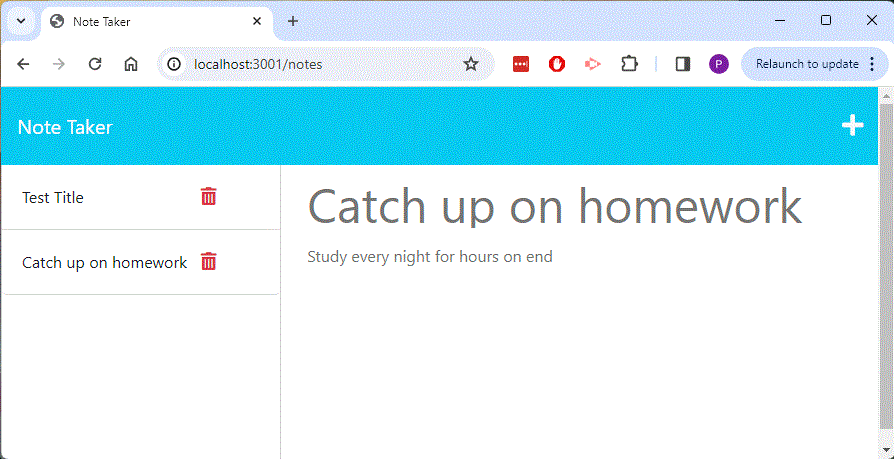

# Note Taker
Module 9 Challenge

## Description

The repository holds files to create a simple note taker
  1) The user is presented with a notepad with the ability to add notes in the right side and click on a "save" button.
  2) Once saved, the note's title will appear in a column on the left.
  3) User can recall the note on the left by clicking on it and then having it reappear on the right again.
  4) Although there is a red trashcan in the column on the left, at this time it does not have any functionality.

## Installation

Contains\
  server.js\
  The /db directory contains a JSON file that holds the notes
  Javascript index.js under directory /public/assets/js\
  A small utility script to assign random strings is under /helpers\

## Screenshot

## Deployed at https://note-taker-pjm-3740623ce2ba.herokuapp.com/notes

## Repository at https://github.com/petemaynard/Note_Taker

## Credits

Created by Pete Maynard
with some assistance from tutor Dru Sanchez

